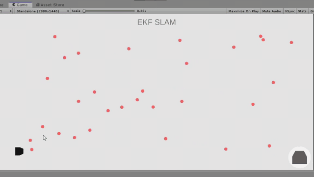
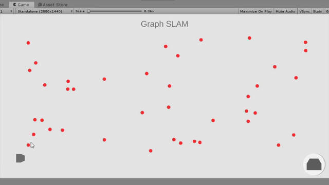

# SLAM-Unity
A unity visualization of the three basic simultaneous localization and mapping (SLAM) algorithm.

The implmentation was written in C#, with algorithm heavily adapted from Python Robot by 
Dr.Atsushi Sakai (https://atsushisakai.github.io/PythonRobotics/) and 
Tim Bailey (http://www-personal.acfr.usyd.edu.au/tbailey/software/). Math.NET (https://numerics.mathdotnet.com/) was used for numerical computation.

## EKF SLAM

## Fast SLAM
!FAST](GIF/FASTSLAM.gif)
## Graph SLAM

